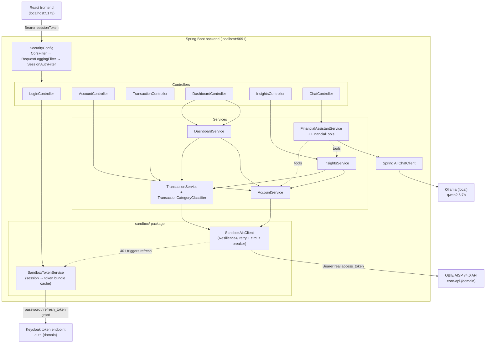
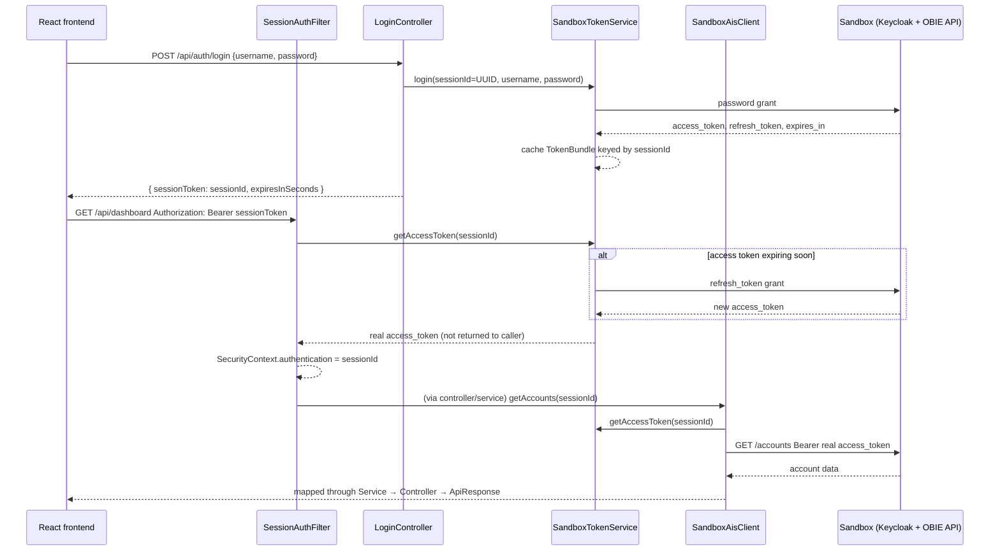

# Architecture

## Overview

Every request flows `Controller → Service → SandboxAisClient (live HTTP) / AI layer`. There is
no database — account, balance, and transaction data is fetched from the Hackathon Mock Bank
sandbox fresh on every request, and financial insights are computed on the fly from whatever
transactions come back. See [Why no persistence](#why-no-persistence-and-where-it-would-slot-in)
for the reasoning and where a cache/DB would go later.



## Two-token model (why `sessionToken` ≠ sandbox `access_token`)

The frontend never sees the sandbox's real OAuth2 tokens. `SessionAuthFilter` and
`SandboxTokenService` together keep that boundary:



If the sandbox call 401s mid-request, `SandboxAisClient` refreshes once via `SandboxTokenService`
and retries exactly once before surfacing a `SandboxAuthException` → mapped to a clean `401` by
`GlobalExceptionHandler` (never a raw Keycloak error body).

## Package structure

```
com.banfico.fintech
 ├── auth/        LoginController, SessionAuthFilter, CurrentSession
 ├── sandbox/      SandboxTokenService, SandboxAisClient, dto/ (faithful raw OBIE records)
 ├── account/     AccountService, AccountController (flattens sandbox DTOs → our API shapes)
 ├── transaction/ TransactionService, TransactionCategoryClassifier, TransactionController
 ├── insights/    InsightsService (all 6 metrics), InsightsController
 ├── ai/          ChatClientConfig, FinancialTools (@Tool methods), FinancialAssistantService,
 │                 ChatController
 ├── dashboard/   DashboardService (concurrent fan-out), DashboardController
 ├── common/      ApiResponse<T>, GlobalExceptionHandler, RequestLoggingFilter, Masking,
 │                 Concurrency, PagedResult, RestClientConfig, exception/
 └── config/      SecurityConfig, CorsConfig, SandboxProperties
```

## Concurrency

Per-account sandbox calls (balances, transactions) are fanned out across **virtual threads**
rather than looped sequentially — `common/Concurrency.mapConcurrently` submits one virtual
thread per item to `Executors.newVirtualThreadPerTaskExecutor()` and joins the results back in
input order. Used by:
- `AccountService.listAccounts` — one balance call per account, concurrently
- `DashboardService.buildDashboard` — one transaction-history call per account, concurrently
- `InsightsService` — same pattern, shared across whichever sub-metric a given insights endpoint needs

## Resilience

Every sandbox HTTP call goes through Resilience4j retry + circuit breaker (`application.yaml`,
instances `sandboxToken` and `sandboxAis`): retries on `ResourceAccessException`/
`HttpServerErrorException` (timeouts, 5xx) but **never** on 401 — a 401 instead triggers exactly
one token-refresh-and-retry in `SandboxAisClient`, then surfaces as a clean auth error if it
still fails. The AI layer (`FinancialAssistantService`) wraps every Ollama call in a try/catch
with a graceful fallback (an apologetic message for chat, rule-based tips for coaching) since a
slow/unreachable local model must not crash a live demo.

## Why no persistence (and where it would slot in)

The hackathon brief prioritizes a working end-to-end vertical slice over exhaustive data
modeling, and every domain object (accounts, balances, transactions) already exists as the
source of truth in the sandbox — duplicating it into our own database would just be a cache with
extra steps, and one more thing to keep in sync live during judging. So for this phase:

- No JPA/H2/entities.
- The only in-memory state is `SandboxTokenService`'s session→token-bundle map (necessary — the
  frontend can't hold a real sandbox token) and Spring AI's windowed conversation memory.
- All sandbox I/O is isolated behind `SandboxAisClient`/`SandboxTokenService`, so a cache or
  database can be introduced later **without touching any controller** — the seam is already
  there.

Where persistence would slot in next, if this became a real product:
- **A short-TTL cache (Caffeine, ~30-60s) in front of `SandboxAisClient`** — cuts sandbox round
  trips for repeated dashboard/insights calls within a session, without changing any public
  method signature in `account`/`transaction`/`insights`.
- **A chat-history store** — `ai/ChatClientConfig`'s `MessageWindowChatMemory` is currently
  backed by `InMemoryChatMemoryRepository`; Spring AI ships a JDBC-backed `ChatMemoryRepository`
  (`spring-ai-starter-model-chat-memory-repository-jdbc`) as a drop-in replacement if
  conversations need to survive a restart — swap the one bean in `ChatClientConfig`, nothing
  else changes. Similarly, a user-preferences table would sit alongside this once individual
  users need saved budgets/goals rather than everything being computed live per request.
